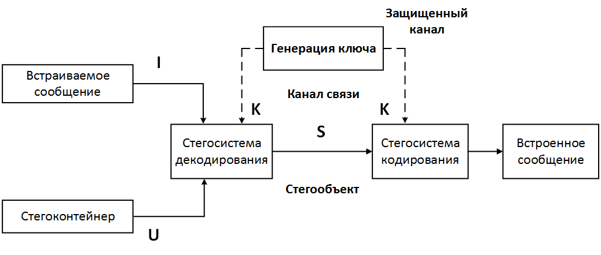

## Курсовая работа по СТЕГАНОГРАФИИ

### 1. Задание

1. Изучить базовые принципы и методы цифровой стеганографии и области применения
2. В соответствии с заданным вариантом разработать алгоритм скрытия информации в виде ЦВЗ или текстового файла в формате .txt. в стегоконтейнер заданного вида
3. Разработать программное обеспечения для его реализации
4. Оценить допустимый объем и качество скрываемой информации
5. Оценить качество стегоконтейнера после встраивания в него информа-
ции

### 2. Индивидуальный вариант задания

- Тип стеганографического контейнера - видео
- Тип скрываемого файла - ЦВЗ
- Способ сжатия, используемый в видеоконтейнере - BMP(без сжатия)
- Способ скрытия информации в видеоконтейнере - скрытие данных в пространственной области
- Метод стеганографического скрытия информации в видеоконтейнере - метод кодирования наименее значащих бит
- Алгоритм оценки качества восприятия стеганоконтейнера после скрытия информации:
    + Среднеквадратическая ошибка (Mean Square Error - MSE)
    + Отношение "сигнал/шум"(Signal to Noise Ratio - SNR)

### 3. Теоретические основы

На сегодняшний день существует два основных метода обеспечения конфиденциальности информации в распределенных автоматизированных системах обработки информации и управления: криптография и стеганография.

Криптография может быть определена как секретная запись. Основная ее функция - это передача информации между двумя сторонами и предотвращение ее чтения третьей стороной.

Стеганография предполагает, что передаваемый текст "растворяется" в сообщении большего размера с совершенно "посторонним" смыслом. Поэтому в последнее время возможность сокрыть дополнительную информацию в передаваемых файлах стали использовать для защиты передаваемых данных от незаконного копирования.

Такая задача стала особенно актуальной в связи с быстрым развитием глобальных компьютерных сетей, по которым передается огромное количество информации без разрешения авторов на ее копирование и распространение. Стеганография - это древнее искусство внедрения частных сообщений путем скрытия в безвредных на вид сообщениях таким образом, что третья сторона не подозревает о факте существования какой-либо скрытой информации.

Целью компьютерной стеганографии является реализация метода информационного обмена конфиденциальными сообщениями по открытым телекоммуникационным каналам, когда скрывается сам факт существования конфиденциальной связи между респондентами, при условии обеспечения высокого качества стегоконтейнера, содержащего скрываемые данные во избежание его анализа и "взлома" посторонними лицами.

Целью курсовой работы является изучение основных теоретических принципов, а также методов компьютерной стеганографии с криптографическим закрытием передаваемых сообщений.
Задачами курсовой работы являются экспериментальные исследования основных характеристик компьютерной стегосистемы, реализующей криптографическое закрытие информации.

В качестве способа скрытия информации в данной работе используется **метод кодирования наименее значащих бит.**

#### 3.1 Структура стеганографической системы

Пример структуры стеганографической системы приведен на рисунке 1. Любая стеганографическая система состоит из стегоконтейнера (того, во что будет встраиваться информация)(U), встраиваемого сообщения(I), стегосистемы кодирования и стегосистемы декодирования информации. При обработке сообщения в стегосистеме кодирования формируется стегообъект (S).

Стегообъект передается по каналу связи и в стегосистеме декодирования из него извлекается встроенное сообщение. Таким образом, стеганографический процесс может быть отображен в виде функции от 2-х параметров, т.е. ``S = f(U,I)``. Также для повышения надежности передаваемого сообщения передающая и принимающая стороны могут использовать дополнительный ключ (К).

#### 3.2 Требования к стеганографической системе

Для того чтобы стеганографическая система могла использоваться в современном процессе сокрытия информации, в процессе стеганографического скрытия должен формироваться стегообъект, отвечающий следующим требованиям:
- при изменениии определенного числа информационных бит в структуре стегообъекта не должна привести к значительным потерям его качества, то есть к потерям скрытой информации
- скрытая в стегообъекте информация должна остаться невредимой в результате фильтрации, конвертирования, кодирования, сжатия, печати, сканирования, дискретизации, цифро-аналогового преобразования, аналого-цифрового преобразования и других классических испытаниях, которым может подвергаться стегообъект в процессе транспортировки или атаки.

Последнее требование можно отнести в основном к группе требований по защите скрытой информации от несанкционированного доступа. Оно, как правило, является обязательным для систем "цифровых водяных знаков" - одного из наиболее перспективных направлений развития стеганографии в области защиты целостности аудио- видеоинформации. Однако для обеспечения основной задачи стеганографии необходимо и достаточно выполнение только первого из перечисленных выше требований.

С другой стороны, стеганографический метод должен обеспечить сокрытие передаваемых конфиденциальных данных таким образом, чтобы изменение информационных бит в стегоконтейнере не приводило к особым потерям его качества. В противном случае считается, что задача стеганографии не выполнена.

Известно, что существующая обратная зависимость между количеством скрываемой информации и качеством стегоконтейнера математически доказана только для некоторых систем сокрытия данных, практика показала, что эта взаимосвязь действительна для всех систем. Поэтому существенные искажения стегоконтейнера во время сокрытия в нем конфиденциальной информации можно избежать путем уменьшения количества скрываемых данных.

Таким образом, к стеганографическим системам предъявляются следующие требования:

- Высокое качество стегоконтейнера
- Максимально возможное количество скрываемых данных
- Высокая скорость сокрытия информации
- Возможность их применения для графических файлов других форматов
- Возможность внедрения дополнительных средств защиты скрываемой информации (например, шифрование, пропуск малозначащих бит и т.д.)

